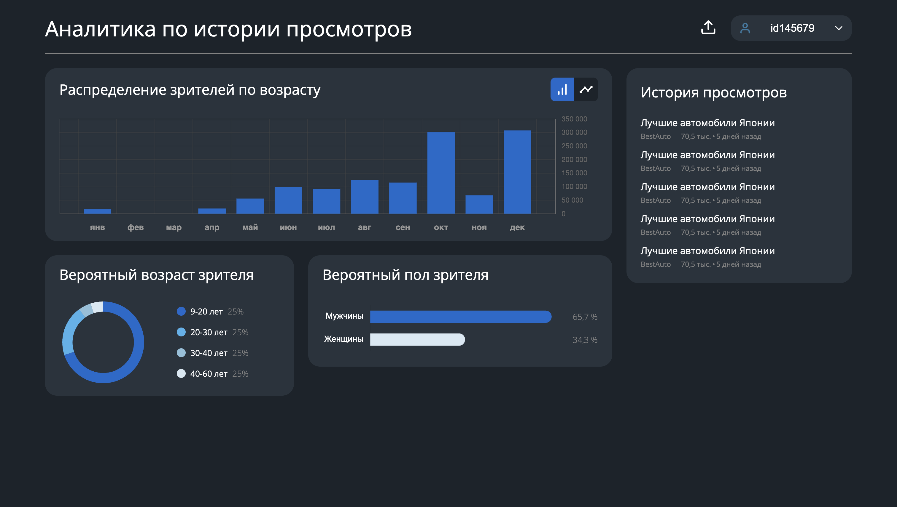

# Подбор локаций для размещения рекламы

## Описание

Advertising — это веб-приложение, разработанное для упрощения процесса управления и анализа данных по рекламе. Приложение позволяет пользователям загружать CSV-файлы, содержащие данные по рекламе, и предоставляет прогнозы и инсайты на основе загруженных данных.


## Задача
### Подбор локаций для размещения рекламы
[Скачать данные по кейсу](https://lodmedia.hb.bizmrg.com/cases/1113064/%D0%9C%D0%B5%D0%B4%D0%B8%D0%B0%D0%B2%D0%B0%D0%B9%D1%81%20(1).pdf)

Современный рынок рекламы требует от рекламных агентств непрерывно повышать эффективность планирования и оптимизировать затраты на размещение рекламы.

Таким образом, агентствам необходимо быстро прогнозировать максимальный эффект от рекламы за минимальные вложения денег.

В наружной рекламе эта проблема стоит особенно остро, так как процесс планирования идеального расположения щитов и расчет их минимального количества при сохранении заметности рекламы остается трудоемким и требует значительных временных затрат. В настоящее время существуют инструменты, которые собирают данные о проходимости каждой рекламной точки, а также могут прогнозировать совокупность охваченных людей для нескольких точек одновременно. Однако, процесс планирования идеальной комбинации точек для максимального количества охваченных людей за кампанию пока не автоматизирован, и занимает большое количество времени без гарантии достижения максимального результата

Предлагается создать инструмент, использующий технологии машинного обучения, для прогнозирования оптимального расположения рекламных щитов в городе с целью максимизации количества совокупно охваченных людей. На основе данных о предыдущих рекламных кампаниях и их эффективности, участникам хакатона предстоит разработать систему, которая автоматически предложит наиболее эффективные комбинации локаций. Это позволит существенно ускорить процесс планирования рекламных кампаний, повысить их качество и эффективность, обеспечивая рекламодателям уверенность в достижении максимального охвата аудитории. Решение должно быть представлено в виде веб-интерфейса, визуально отражающего на карте наиболее эффективную комбинацию точек, имеющую максимальный охват, по заданным параметрам.

## Возможности

- **Загрузка CSV**: Пользователи могут загружать CSV-файлы в приложение.
- **Обработка данных**: Сервер обрабатывает загруженные данные, включая обработку полей JSON внутри CSV.
- **Прогнозы**: Используется предобученная модель CatBoost для предоставления прогнозов на основе обработанных данных.
- **Визуализация**: Отображает обработанные данные и прогнозы пользователю.

## Список использованных технологий:

### Фронтенд
- **React**: Библиотека JavaScript для создания пользовательских интерфейсов.
- **Redux**: Предсказуемое хранилище состояния для JavaScript-приложений.
- **Axios**: Клиент HTTP на основе промисов для браузера и Node.js.

### Бэкенд
- **FastApi**: Высокоуровневый веб-фреймворк на языке Python, способствующий быстрому разработке и удобству.
- **Pandas**: Быстрая, мощная, гибкая и простая в использовании библиотека для анализа и манипулирования данными в Python.
- **CatBoost**: Высокопроизводительная библиотека с открытым исходным кодом для градиентного бустинга на решающих деревьях.

### Дополнительные библиотеки
- **Joblib**: Набор инструментов для легкого конвейера в Python.
- **GeoPandas**: Проект с открытым исходным кодом для упрощения работы с геопространственными данными в Python.


## Запуск проекта
```sh
   docker compose up --build
```

# Результаты
[Colab](https://colab.research.google.com/drive/1ffS553icfijC_Di3qTHUY52vQcdhhqSO?usp=sharing#scrollTo=b7lGEeWQ5E9e)

## Контакты
DS:
- https://github.com/jettooss
- https://github.com/BogdanRoshchupkin
- https://t.me/Alukiko          

FRONT:
- https://github.com/MarianRoshchupkin             

BACKEND:
- https://github.com/deZKI
